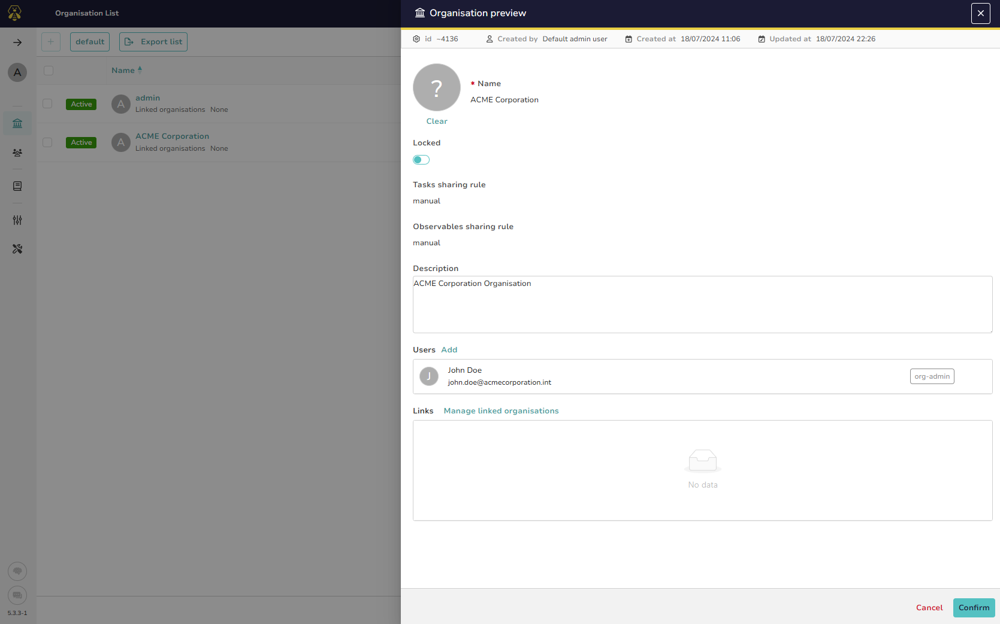

# Managing an Organisation

## Edit your Organisation

Once your organisation is created:

* [users](./accounts.md) can be added
* [links](./organisation-links.md) with other existing Organisations created for the purpose of sharing Cases.

## Lock an Organisation
An existing Organisation can be locked so that all users belonging to this one cannot log into it.

&nbsp;